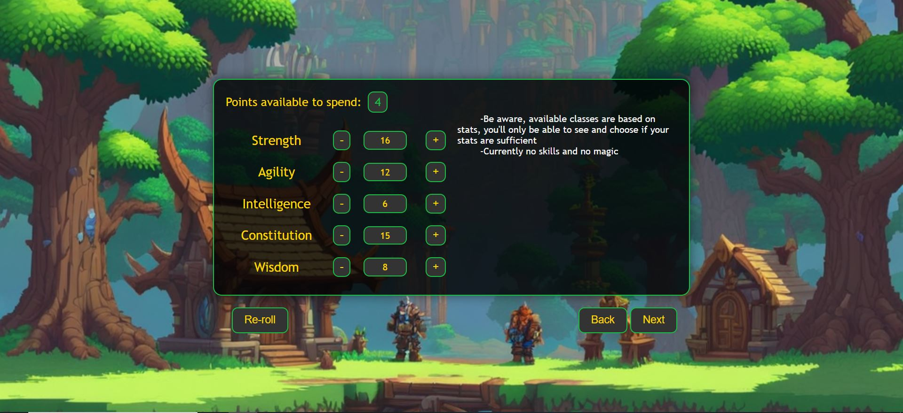
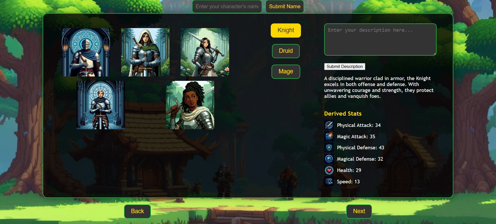

# Welcome to my TurnBase Rpg game (still in progress)

## Goal of the project  
Wanted to learn aspects of Backend and since I like games it didn't sit well with me to make a boring "To do app", soo I decided to make a Turn base RPG browser game. On this journey I learned a lot about Flask, HTML, CSS, communication with databases and most importantly didn't want to learn JavaScript for this project soo using Jinja 2 for dynamic communication between frontend and backend
helped a lot.  
Game is currently in it's infancy and currently you can only play it on local host. Furthermore, chances of it getting finished are slim but all thats left are more enemies, more items and more areas to visit. The main goal of learning and getting exposed to the concepts of backend and frontend is achieved :).  
*All art you will see on the screenshots below are generated by AI.*

## Features  
1. **Cretaing character**  
   * During character creation your stats are randomized, you can reroll as many times as you want and invest your stats points which is very important because to **choose** a class you have to pass certain stats tresh hold 
   
   

## Table of Contents
- [Goal of the project](#goal-of-the-project)
- [Features](#features)
- [Screenshots](#screenshots)
- [Getting Started](#getting-started)
- [Technologies used](#technologies-used)

## Getting Started
Before getting access to the game there is couple of things you should do:
1. **Clone repository** - `https://github.com/gitLonan/Flask-projects.git`
2. **Create virtual environment**
   * Windows (cmd or PowerShell) - `python -m venv venv`
   * Mac & Linux (Terminal) - `python3 -m venv venv`
3. **Activate virtual environment**
   * Windows(PowerShell) - `venv\Scripts\Activate.ps1`
   * Windows (CMD) - `virtual\Scripts\activate.bat`
   * macOS/Linux - `virtual/bin/activate`
4. **Run dependencies.sh file**  
   If by any chance it doesn't work you can install all of these on their own, just make sure you are inside of the virtual environment: 
      * `pip install flask`
      * `pip install "flask<3" "werkzeug<3"`
      * `pip install flask-wtf`
      * `pip install flask-sqlalchemy`
      * `pip install flask-migrate`
      * `pip install python-dotenv`

## Technologies used
 - Python 3.9.5 or newer
 - rest are found inside of a file "requirements.txt"
